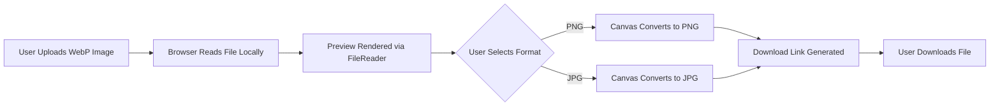

# xsukax WebP Converter

## Project Overview

**xsukax WebP Converter** is a lightweight, privacy-focused web application that enables users to **convert WebP images into PNG or JPG formats** directly within their browser. The application performs all operations locally—no data is uploaded to external servers—ensuring user privacy and speed. With a clean and responsive interface, it offers an intuitive drag-and-drop upload area, real-time image preview, and instant conversion powered by HTML5 Canvas and JavaScript.

---

## Security and Privacy Benefits

This project emphasizes user data protection through complete client-side processing:

* **No server interaction:** All image conversions occur within the browser using native JavaScript APIs. Files never leave the user’s device.
* **Secure File Handling:** Temporary object URLs are created and revoked during each conversion, minimizing memory leaks and ensuring session-level privacy.
* **No dependencies or trackers:** The app uses pure HTML, CSS, and JavaScript with no third-party libraries, protecting users from potential data collection or external network requests.
* **Ephemeral Data Lifecycle:** Uploaded files, preview images, and converted outputs are discarded immediately after the user resets or closes the page.

These measures collectively guarantee **zero data transmission**, **no cloud storage**, and **full control over user content**.

---

## Features and Advantages

* **Full Offline Operation:** Works completely offline once loaded in the browser.
* **Instant Conversion:** Convert WebP images to PNG or JPG in seconds.
* **Privacy-First Design:** No uploads, no data logging, and no third-party scripts.
* **Lightweight & Fast:** Runs efficiently even on low-resource devices.
* **User-Friendly Interface:** Drag-and-drop support, image preview, and interactive messages.
* **Cross-Platform Compatibility:** Works seamlessly on all major browsers (Chrome, Edge, Firefox, Safari).
* **Reset Functionality:** Clears memory and interface for a new session.

---

## Installation Instructions

You can use xsukax WebP Converter directly in your browser or host it locally.

### Option 1: Use Directly via GitHub Pages

Visit: [https://github.com/xsukax/xsukax-webp-Converter](https://github.com/xsukax/xsukax-webp-Converter)

### Option 2: Run Locally

1. **Clone the repository:**

   ```bash
   git clone https://github.com/xsukax/xsukax-webp-Converter.git
   ```
2. **Navigate to the project folder:**

   ```bash
   cd xsukax-webp-Converter
   ```
3. **Open the application:**

   * Simply double-click the `index.html` file.
   * Or, open it in your preferred browser using the `file://` protocol.

No installation or additional dependencies are required.

---

## Usage Guide

1. **Open the Application:** Launch `index.html` in your browser.
2. **Upload Image:** Drag and drop a `.webp` file into the upload area or click to browse.
3. **Select Format:** Choose between `PNG` or `JPG` conversion.
4. **Preview:** View the image preview before conversion.
5. **Convert:** Click **Convert** to process the image locally.
6. **Download:** Save the converted image via the download button.
7. **Reset:** Use **Reset** to clear the interface and prepare for a new file.

### Process Flow Diagram



---

## Licensing Information

This project is licensed under the **GNU General Public License v3.0**.
